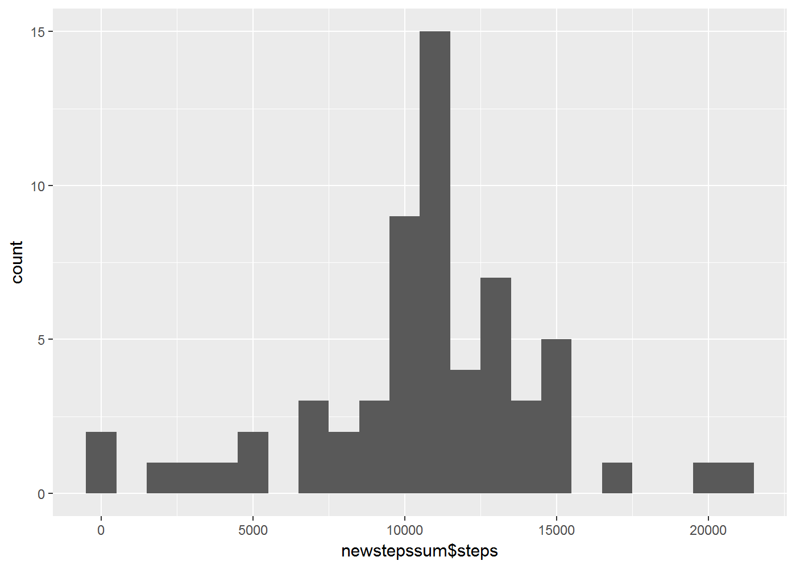
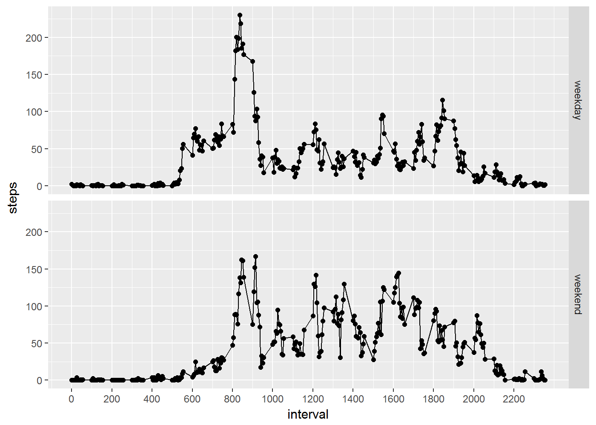

# Reproducible Research: Peer Assessment 1

## Libraries needed

```r
library(stringr)
library(ggplot2)
library(knitr)
library(dplyr)
```

## Set Global parameters

Setting the global parametes of echo = TRUE and warning = FALSE
(some commands generate warning with missing values)


## Loading and preprocessing the data

```r
setwd("~/Course 5 -Reproducible Research/Week 2/repdata_data_activity")
actdata <- read.csv("activity.csv",na.strings = NA)
```

We will now be converting the date variable from a factor into a date format variable.

```r
actdata$date <- as.Date(strftime(actdata$date,format = "%Y-%m-%d"))
```
Validate the data types

```r
str(actdata)
```

```
## 'data.frame':	17568 obs. of  3 variables:
##  $ steps   : int  NA NA NA NA NA NA NA NA NA NA ...
##  $ date    : Date, format: "2012-10-01" "2012-10-01" ...
##  $ interval: int  0 5 10 15 20 25 30 35 40 45 ...
```

## What is mean total number of steps taken per day?

### Get the sum(step) by date
We will now calculate steps per day into another dataframe.

```r
stepssum <- actdata %>% group_by(date) %>% summarise(steps = sum(steps)) %>% arrange(date) 
```
### Plotting the total steps by day histogram
Lets start off by creating a histogram of the steps taken per day for the two months
and then calculate the mean and the median.

```r
qplot(stepssum$steps,geom = "histogram" , binwidth = 1000)
```


### Getting the mean
The Average number of steps as calculated by the mean function ignoring the NA values in a day is :

```r
mean(stepssum$steps,na.rm = TRUE)
```

```
## [1] 10766.19
```
### Getting the median
The Median observation of steps in the given dataset as calculated by the median function, ignoring the NA values is :

```r
median(stepssum$steps,na.rm = TRUE)
```

```
## [1] 10765
```

## What is the average daily activity pattern?

### Get the mean(step) of all days by interval
A timeseries plot of the dataset will generate a line plot of the average of the steps for a given interval across all days.

we will now calculate average steps per interval into another dataframe.


```r
stepsavg <- actdata %>% group_by(interval) %>% summarise(steps = mean(steps,na.rm = TRUE)) %>% arrange(interval) 
```
### Plotting the average activity by interval line curve
The plot below shows the average number of steps for all days for a given interval.
we can determine the activity pattern of the person by analyzing the average daily activity.

```r
qplot(interval,steps,data=stepsavg)+geom_line(colour="black",stat = "identity")+geom_point(na.rm = TRUE)+scale_x_continuous(breaks = round(seq(min(stepsavg$interval), max(stepsavg$interval), by = 200),1))
```


### Calculate the interval which has max avg steps
The interval having the max average steps is obtained by executing this code :

```r
unclass(stepsavg[(stepsavg$steps == max(stepsavg$steps)),1])[1]
```

```
## $interval
## [1] 835
```


## Imputing missing values

### Cleanup the data
There are some observations that have NA as the number of steps for intervals in a day.

We can list out the total number of missing values in the dataset.

Internally the logical value of TRUE is represented by a number 1 and FALSE by 0
Thus, just by adding all the TRUE's, we can obtain a count of the missing values when the dataset is run thru the is.na function.

```r
sum(is.na(actdata$steps))
```

```
## [1] 2304
```
### Cleanup strategy
Now, the dataset presented to us, had missing values represented by NA
Since steps is an integer count of the human action of walking, we can fill in the missing values with a value that is the average steps of that interval

Make a copy of the original dataframe.

```r
newactdata <- actdata  %>% arrange(date,interval)
```
### Impute the data
We will find the average of the interval by refering to the stepsavg dataframe created earlier, replace the NA values by the average steps for the interval, rounded to two decimal points

```r
combined <- merge(x=actdata,y=stepsavg,by="interval",all.x = TRUE)
subord <- combined %>% filter(is.na(steps.x)) %>% arrange(date,interval)
newactdata[is.na(newactdata$steps),"steps"] <- round(subord$steps.y,2)
```
Lets check the new data table (note: the averages populated in steps)

```r
head(newactdata)
```

```
##   steps       date interval
## 1  1.72 2012-10-01        0
## 2  0.34 2012-10-01        5
## 3  0.13 2012-10-01       10
## 4  0.15 2012-10-01       15
## 5  0.08 2012-10-01       20
## 6  2.09 2012-10-01       25
```
We will now calculate imputed steps per day into another dataframe.

```r
newstepssum <- newactdata %>% group_by(date) %>% summarise(steps = sum(steps)) %>% arrange(date) 
```
### Plot the imputed histogram
The Histogram of the imputed average steps to date is as below.
(note: we have )

```r
qplot(newstepssum$steps,geom = "histogram", binwidth = 1000)
```



### Getting the mean
The Average number of steps as calculated by the mean function in a day is :

```r
mean(newstepssum$steps)
```

```
## [1] 10766.18
```
### Getting the median
The Median observation of steps in the given dataset as calculated by the median function is :

```r
median(newstepssum$steps)
```

```
## [1] 10766.13
```

## Are there differences in activity patterns between weekdays and weekends?

### weekday or weekend
Make a list of weekends, and also make a list of day labels.

```r
wknd <- c("Saturday","Sunday")
daylbl <- c("weekday","weekend")
```
### A new variable day in the dataset
Create a new variable, day and assign it a value "weekday" or "weekend" by performing a test if the output of the function weekdays() of the date in the dataset is in the wknd list, if it does not exist pick the first element, which is weekday else, pick the second element, which is weekend.
(note: again the logical output of true or false will be considered 1 or 0 from internal representataion)

```r
newactdata$day <- daylbl[(weekdays(newactdata$date) %in% wknd)+1]
```
Lets check the new column

```r
str(newactdata)
```

```
## 'data.frame':	17568 obs. of  4 variables:
##  $ steps   : num  1.72 0.34 0.13 0.15 0.08 2.09 0.53 0.87 0 1.47 ...
##  $ date    : Date, format: "2012-10-01" "2012-10-01" ...
##  $ interval: int  0 5 10 15 20 25 30 35 40 45 ...
##  $ day     : chr  "weekday" "weekday" "weekday" "weekday" ...
```
Lets further check the content of the new column added 
(note: we have both weekday and weekend data)

```r
unique(newactdata$day)
```

```
## [1] "weekday" "weekend"
```

### Calculate the average steps per weekday/weekend per interval
A timeseries plot of the dataset will generate a line plot of the average of the steps for a given interval across all weekdays in one panel, and weekends in another.

we will now calculate average steps per day per interval into another dataframe.


```r
newstepsavg <- newactdata %>% group_by(day,interval) %>% summarise(steps = mean(steps)) %>% arrange(day,interval) 
```
### Plotting the average activity by interval line curve in two panels
The plot below shows the average number of steps for all weekdays and weekends as a comparison for a given interval.
we can now compare and contrast the activity pattern of the persons weekday and weekend activities. 

```r
qplot(interval,steps,data=newstepsavg,facets = day~.)+geom_line(colour="black",stat = "identity")+scale_x_continuous(breaks = round(seq(min(newstepsavg$interval), max(newstepsavg$interval), by = 200),1))
```



## Findings

#### It looks like the person has a less intense more even spreadout activity on the weekends, but a high intensity activity in the mornings during weekdays. 

